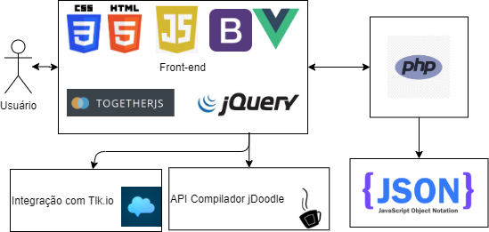
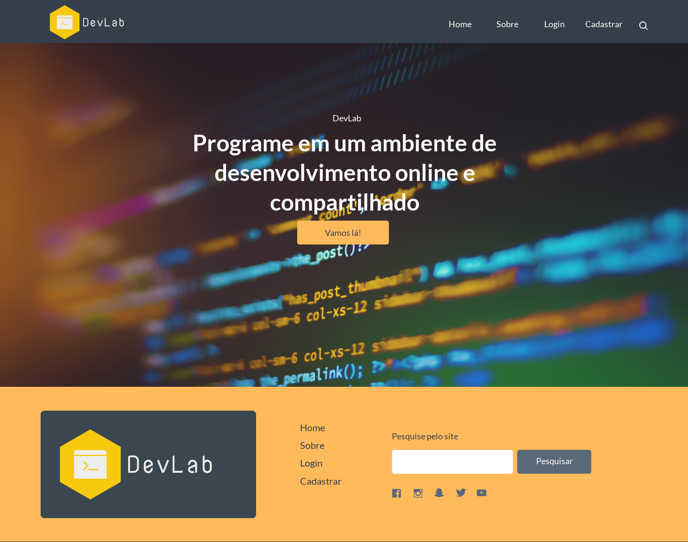
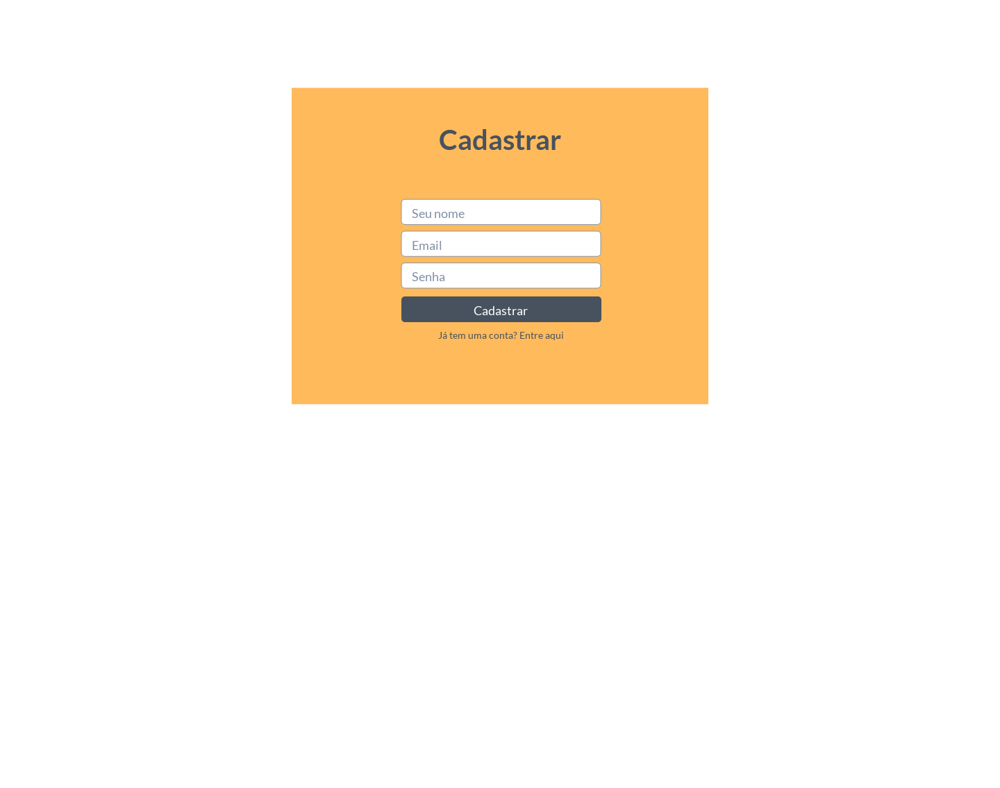
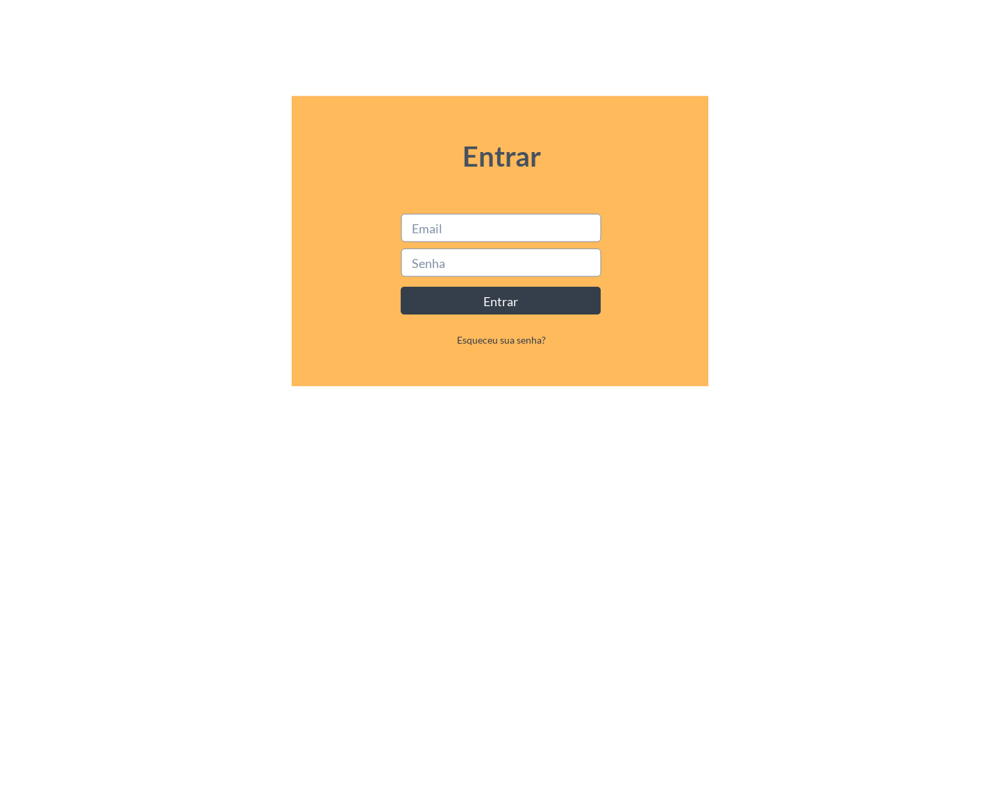
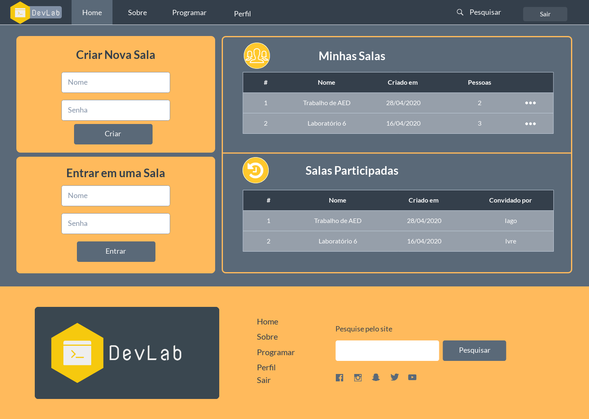
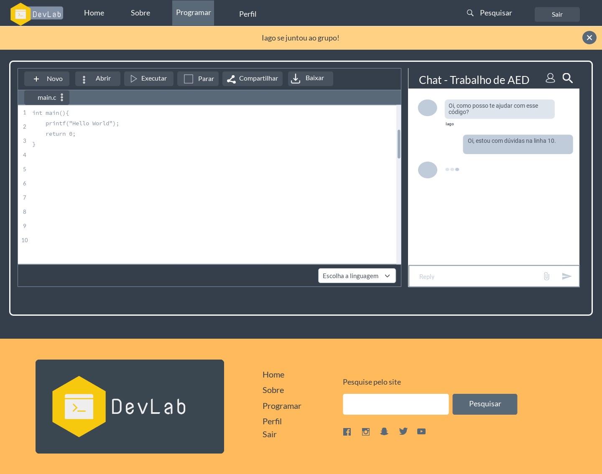
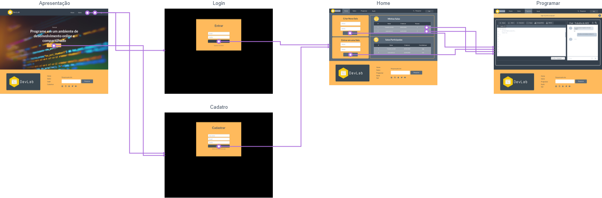

# Informações do Projeto
`DevLab`  

Trabalho Interdisciplinar - Aplicacões Web

`Engenharia de Software`

`1º Semestre de 2020 - 1º Período`

# Introdução

<!-- > Nesse momento você deve apresentar o problema que a sua aplicação deve resolver. No entanto, não é a hora de comentar sobre a aplicação. Descreva também o contexto em que essa aplicação será usada, se houver: empresa, tecnologias, etc. Novamente, descreva apenas o que de fato existir, pois ainda não é a hora de apresentar requisitos detalhados ou projetos. -->
Essa aplicação visa resolver as dificuldades que os alunos de cursos da área de Tecnologia da Informação que cursam disciplinas de desenvolvimento, ou seja, disciplinas que demandam escrita de códigos e programação, enfrentam em relação à realização de trabalhos, atividades e práticas de laboratório dessas tais disciplinas.

Essas dificuldades podem ser definidas especificamente como acessibilidade e contato irregular entre professores e alunos para sanar dúvidas, em alguns casos elas se apresentam como o aluno não possuir o hardware ou software necessário para a realização das suas atividades acadêmica de desenvolvimento em casa, sendo também apresentadas como a falta de auxílio do professor ou do colega de classe ao realizar as tarefas.

O que ocorre muita das vezes são situações às quais o aluno enfrenta dificuldades de configurar seu computador de casa para a realização das tarefas, tendo problemas ao instalar alguma IDE ou software necessário para a prática. 
Também ocorrem outras situações as quais o aluno não encontra um meio de tirar sua dúvida com o professor ou colega, por precisar de compartilhar seu código ou mostrar algo a mais ocorrendo na execução do mesmo.

## Participantes
Os membros do grupo são: 
- Guilherme Luiz Carvalho Pinto
- Iago Enrique dos Santos Braz

## Público-alvo

<!-- > Descreva quem serão as pessoas que usarão a sua aplicação indicando os diferentes perfis. O objetivo aqui não é definir quem serão os clientes ou quais serão os papéis dos usuários na aplicação. A ideia é, dentro do possível, conhecer um pouco mais sobre o perfil dos usuários: conhecimentos prévios, relação com a tecnologia, relações hierárquicas, etc.
>
> Adicione informações sobre o público-alvo por meio de uma descrição textual, ou diagramas de personas, mapa de stakeholders, ou como o grupo achar mais conveniente. -->

O público alvo do software realizado são estudantes e alunos de cursos da área de Tecnologia da Informação que possuem disciplinas de desenvolvimento e programação na grade curricular que estão realizando e que são afetados por problemas de organização de tempo, de disponibilidade de equipamento ou de auxílio de aprendizagem na dinâmica atual de realização de tarefas e atividades dessas disciplinas quando estão fora do ambiente institucional. 

Ademais, o público alvo também envolve os professores das disciplinas citadas acima que também são afetados por problemas de não conseguir passar todo o conteúdo durante o tempo de aula e de não conseguir auxiliar alunos em certos tipos de dúvidas mais específicas. 

Portanto, o público alvo já é familiarizado com sistemas automatizados, softwares de desenvolvimento e aplicações relacionadas à fóruns com modelagem de perguntas e respostas.

## Objetivos

<!-- >Aqui você deve descrever os objetivos do trabalho indicando que o objetivo geral é desenvolver um software para solucionar o problema apresentado acima. Apresente também alguns (pelo menos 2) objetivos específicos dependendo de onde você vai querer concentrar a sua prática investigativa, ou como você vai aprofundar no seu trabalho. -->

O objetivo do trabalho é desenvolver um software que ajude a melhorar e mitigar o problema apresentado acima. Assim, criar um software que disponibilize um ambiente de desenvolvimento adequado para os alunos programarem códigos destinados às suas atividades acadêmicas. De forma que esse ambiente seja uma IDE online, para que o acesso seja democrático e ajude os alunos que não possuem o equipamento necessário.

Além disso, realizando o mesmo de maneira que seja disponibilizado o compartilhamento em tempo real de problemas e soluções entre os alunos entre si e professores. De modo a possibilitar os usuários a se comunicarem por um bate papo ao vivo, para assim mitigar a situação de esclarecimento de dúvidas e fixação da matéria por parte dos alunos.

Portanto, permanecendo com o foco do propósito do trabalho em melhorar a experiência acadêmica de aprendizagem. De maneira a priorizar tanto o lado do professor que irá possuir outras formas de transmitir conteúdo e ajudar na fixação do mesmo, quanto a parte do aluno que terá disponibilizado um conforto maior em aprender e em ajudar os seus colegas.

## Justificativa

<!-- >Descreva a importância ou a motivação para trabalhar com esta aplicação que você escolheu. Indique as razões pelas quais você escolheu seus objetivos específicos ou as razões para aprofundar em certos aspectos do software. -->

A justificativa de escolha do trabalho tem como principal razão os problemas que os autores do documento encontram em realizar suas atividades acadêmicas  de desenvolvimento fora da instituição. A motivação também nasceu na percepção de que os problemas mitigados pelo trabalho poderiam ser úteis para outros estudantes. 

A disponibilização do ambiente online é de grande prioridade, pois envolve a necessidade dos autores do documento de realizar as tarefas de desenvolvimento enquanto possuem um tempo livre em outro espaço onde não possuem os equipamentos necessários para as atividades. Desse modo, para também contribuir com o melhor aproveitamento do pouco tempo livre dos autores.

# Requisitos

## Histórias de Usuários

|EU COMO... `PERSONA`| QUERO/PRECISO ... `FUNCIONALIDADE` |PARA ... `MOTIVO/VALOR`  |
|--------------------|--------------------------|-------------------------------|
|Aluno| Poder estudar utilizando um ambiente de desenvolvimento online e compartilhado |Me preparar para a prova quando o acesso ao laboratório estiver limitado e eu não possuir um equipamento para tal prática |
|Professor | Poder acompanhar e ajudar meus alunos enquantos eles estudam em um ambiente de desenvolvimento online e compartilhado | Integrar o ensino e tirar dúvidas com mais eficiência e rapidez |
|Monitor| Acompanhar e ajudar os alunos enquanto realizam suas práticas de desenvolvimento| Entender melhor suas dúvidas e poder saná-las com mais facilidade|

## Requisitos Funcionais
|ID    | Descrição do Requisito  |
|------|-----------------------------------------|
|RF-001| Disponibilização de um ambiente de desenvolvimento(IDE) online |
|RF-002| Compartilhamento em tempo real do ambiente de desenvolvimento |
|RF-003| Gravação dos arquivos criados no ambiente de desenvolvimento |
|RF-004| Comunicação entre os usuários em tempo real por meio de chats |

<!-- > Enumere os requisitos funcionais previstos para a sua aplicação. Ou seja, descreva os requisitos ou cenários que auxiliam na validação final da aplicação. Histórias de Usuários apresentam uma boa forma de detalhar os requisitos funcionais da aplicação. -->

## Requisitos não Funcionais
|ID     | Descrição do Requisito  |
|-------|-------------------------|
|RNF-001| O sitema deve estar disponível em 99,9% das vezes que o usuário utilize |
|RNF-002| Deve ser de fácil usabilidade para todos os usuários |

## Restrições
|ID| Restrição |
|--|---------------|
|01| O projeto deverá ser entregue até o final do semestre |
|02| Não pode ser desenvolvido um módulo de backend |
|03| O projeto não consta com um fundo de investimento |
|04| Os participantes não possuem experiência avançada |
|05| Os participantes possuem outras matérias à se dedicar |
|06| O grupo conta com apenas 2 participantes |

<!-- > Enumere as restrições à sua solução. Lembre-se de que as restrições geralmente limitam a solução candidata. -->

# Metodologia

<!-- > Descreva aqui a metodologia de trabalho do grupo para atacar o problema. Isto inclui os tipos de artefatos/documentos que o grupo pretende gerar, a divisão de papéis, as formas de comunicação, os processos definidos e as ferramentas empregadas. Coloque  informações sobre detalhes da implementação do Scrum seguido pelo grupo. -->
A equipe definiu que serão produzidos alguns artefatos ao longo do trabalho. Os mesmos incluem o backlog da aplicação organizado pela prioridade de cada item, protótipos de funcionalidades do produto sendo os tais telas ou até mesmo códigos simplificados, código da nova funcionalidade implementada e por fim testes de validação da funcionalidade.

## Divisão de Papéis

A divisão de papéis e de tarefas será baseada de forma a cada um poder escolher inicialmente as tarefas que querem executar na sprint. Entretanto, caso o indivíduo termine suas tarefas e exista itens no backlog da sprint ou do produto, ele é obrigado a apropriar a tarefa de maior prioridade e executar a mesma.

## Processo
A metodologia de trabalho foi definida pela equipe de modo a utilizar o método ágil Scrum, sendo que as iterações do mesmo irão durar aproximadamente 2 semanas.

As reuniões cruciais para o funcionamento do tal método, como sprint review e sprint planning, irão ocorrer em 2 dias fixos da semana, sendo definido como terça-feira e sexta-feira.

## Ferramentas
A ferramenta que será utilizada pela equipe para organizar tarefas e agregar à metodologia Scrum é o Trello. O mesmo será utilizado de forma que a equipe irá possuir um quadro contendo as funcionalidades que já foram implementadas, as funcionalidades que cada um está implementando e o backlog do produto, o qual será definido pelas funcionalidades e melhorias que ainda devem ser implementadas no produto. 

O grupo definiu que irá realizar a confecção da documentação do projeto utilizando da ferramenta Google Docs, devido sua simplicidade e facilidade de compartilhamento. Ademais, o grupo definiu que o compartilhamento de arquivos irá ser realizado tanto via Google Drive quanto via GitHub.

<!-- As ferramentas empregadas no projeto são:
- Editor de código
- Ferramentas de comunicação 
- Ferramentas de diagramação -->

# Projeto da Solução

<!-- > Descreva aqui qual(is) tecnologias você vai usar para resolver o seu problema, ou seja implementar a sua solução. Liste todas as tecnologias envolvidas, linguagens a serem utilizadas, serviços web, frameworks, bibliotecas, IDEs de desenvolvimento, e ferramentas.  Apresente também uma figura explicando como as tecnologias estão relacionadas ou como uma interação do usuário com o sistema vai ser conduzida, por onde ela passa até retornar uma resposta ao usuário. -->
O projeto da solução consta como conteúdo tecnologias diversas que serão utilizadas para implementar o software enquanto almeja-se resolver o problema  proposto. Dentre essas tecnologias encontram-se itens que podem ser divididos entre tecnologias que serão utilizadas no lado do cliente, ou seja no front-end, e tecnologias que serão usadas para armazenar dados. 

As tecnologias relacionadas ao front-end serão HTML5, CSS3, JavaScript, jQuery e o framework VueJs para a criação da interface web que será a interface gráfica com o usuário, além de que será utilizada a biblioteca Bootstrap para implementação de seus componentes disponíveis. Ademais, também será utilizada uma tecnologia chamada Together JS que implementa o compartilhamento em tempo real no lado do cliente, a mesma possui funcionalidades de compartilhamento e colaboração de interface em tempo real. Além disso, para a funcionalidade de chat em tempo real será utilizado uma integração com a tecnologia Tlk.io, a qual disponibiliza a criação de salas de chat em tempo real sem a necessidade da criação de contas para os usuários no site da tecnologia.

Além de que, para as funcionalidades de compilação de código a aplicação do projeto irá consumir da API do compilador online da tecnologia jDoodle, para compilar os códigos gerados no ambiente de desenvolvimento. A API da tecnologia jDoodle foi selecionada, pois é a única que implementa as funcionalidades de graça e consequentemente se adequa melhor às necessidades do projeto. Para o consumo dessa API, será utilizada as tecnologias Ajax e Axios, as quais irão realizar requisições no lado do cliente para a API.

O armazenamento de dados da aplicação será realizado de modo a simular um back-end utilizando de apenas um arquivo na linguagem PHP, o qual irá manipular um arquivo JSON contendo os dados armazenados e retornando os mesmos para o front-end da aplicação.
Durante todo o processo de implementação da aplicação, a IDE de desenvolvimento a ser utilizada é o VSCode.

O fluxo da aplicação a partir da interação do usuário com o sistema será conduzido de forma ao usuário utilizar da interface web, fazendo uso das tecnologias HTML5, CSS3 e Bootstrap que proporcionam ao mesmo facilidade no uso do sistema. Após isso, as tecnologias JavaScript, jQuery e o framework VueJS irão manipular as tecnologias Ajax e Axios para realizar a comunicação com o arquivo PHP e o mesmo irá receber a requisição tratando as necessidades da tal, assim retornando os dados requisitados. Posteriormente, esses dados solicitados serão interpretados pelo front-end e apresentados como uma informação para o usuário utilizando da interface web. O fluxo descrito está representado na imagem a seguir:

## Projeto de Interface

Para projetar a interface, foram confeccionados esboços de telas(storyboards), protótipos de telas(wireframes) criados pela plataforma Marvel e userflow gerado a partir dos protótipos de telas. 

Os protótipos de telas ou wireframes criados pelo grupo foram realizados pela plataforma Marvel e são apresentados abaixo: 

Wireframe da Tela Principal:

O wireframe da Tela Principal foi criado tendo em mente que era necessário um visual que atraisse a atenção do usuário. Devido a isso, foi planejado a imagem central com o texto convidando o usuário a experimentar a solução.

Também foi pensado uma barra de navegação com o logo da plataforma que facilitasse o fluxo do usuário pela aplicação.

Além disso, foi planejado um footer padrão para todas as páginas da aplicação que possuisse um aspecto simples e limpo, porém ainda sim funcional. 

Wireframe do Modal de Cadastro:

O wireframe do modal de cadastro foi planejado de tal forma visando facilitar a implementação do mesmo e simplificar o fluxo do usuário pela aplicação. Dessa forma, o usuário tem seu foco no modal apresentado mas visualiza que pode sair do mesmo a partir de um clique.

Wireframe do Modal de Login:

O wireframe do modal de login teve em mente as mesmas características do modal de cadastro, ambos trazem um aspecto simples, porém sofisticado ao site. 

Wireframe da Tela Home:

O wireframe da tela home da aplicação foi pensado tendo como objetivo apresentar para o usuário todas as informações principais do projeto de um modo limpo e organizado. O mesmo dispõe de dois destaques para criar e entrar em uma sala e ao lado de ambos está tanto as salas criadas anteriormente, quanto as salas entradas anteriormente. Portanto, permitindo ao usuário visualizar as informações necessárias para o entendimento e uso da aplicação de forma distribuída.

Wireframe da Tela Programar:

O wireframe da tela programar foi planejado visando apresentar as duas maiores funcionalidades da tela, em uma só disposição. Ou seja, disponibilizar o ambiente de desenvolvimento e o chat multualmente para a visualização do usuário. De forma que o ambiente de desenvolvimento ocupe maior espaço, pois o mesmo representa o diferencial da aplicação e apresenta maior quantidade de informações ao usuário. 

O userflow gerado a partir dos wireframes acima pode ser visualizado abaixo:

O userflow evidencia o fluxo que o usuário pode estar realizando pelas telas do projeto. Primeiramente, o usuário pode acessar os modais de login e cadastro ao clicar nas tais palavras que se encontram na barra de navegação da tela inicial. Seguidamente, a partir desses modais os usuários são direcionados a tela Home da aplicação, a mesma possui opções de criar uma nova sala, entrar em uma nova sala, como também possui a opção de entrar em salas já criadas ou que já foram entradas anteriormente. Todas essas opções direcionam os usuários a tela chamada Programar, a qual possui o botão sair que fecha a sessão do usuário e o direciona para a tela inicial novamente.

<!-- > Inclua os diagramas de User Flow, esboços criados pelo grupo (stoyboards), além dos protótipos de telas (wireframes). Descreva cada item textualmente comentando e complementando o que está apresentado nas imagens. -->

## Arquitetura da solução

> Inclua um diagrama da solução e descreva os módulos e as tecnologias que fazem parte da solução

# Avaliação da Aplicação

<!-- > Apresente os cenários de testes utilizados na realização dos testes da sua aplicação. Escolha cenários de testes que demonstrem os requisitos sendo satisfeitos.  -->
Para a realização da avaliação da aplicação, foram selecionados cenários de testes que verifiquem a funcionalidade da mesma e aprovem os requisitos do projeto. Em síntese, os casos de teste selecionados foram baseados no uso da funcionalidade de colaboração da aplicação por mais de um usuário, os quais era esperado um resultado que ambos usuários pudessem compartilhar o uso do ambiente de desenvolvimento simultaneamente, e assim visualizarem as edições feitas por outros usuários como também realizarem edições que serão apresentadas à ambos usuários.

O primeiro cenário de teste realizado foi o caso onde um usuário não cadastrado tenta logar na aplicação, o mesmo apresentou o resultado esperado, o qual é não permitir o login do usuário. Seguidamente, foi realizado o caso onde um usuário tenta cadastrar um e-mail que já está cadastrado na aplicação, o resultado esperado foi alcançado, o qual é não permitir o cadastro do usuário. Após isso, foi testado o cenário o qual o usuário loga com o e-mail correto, porém digita a senha errada para aquele e-mail cadastrado, o mesmo apresentou o resultado esperado não aprovando o login do usuário.

Ademais, foram realizados testes do fluxo comum, os quais são compostos de um cenário, o qual o usuário se cadastra com um e-mail válido e não cadastrado no sistema, e outro cenário que o usuário loga com um e-mail já cadastrado utilizando das credenciais corretas. Ambos cenários apresentaram fluxo correto, sendo que no primeiro caso o usuário foi cadastrado e no segundo caso o usuário foi logado.

Além disso, foi realizado um dos principais testes da aplicação, o qual um usuário cadastrado loga na aplicação corretamente e cria uma sala para programar utilizando do ambiente de desenvolvimento, inserindo o nome e a senha da sala. O resultado esperado foi obtido, o usuário cria a sala e é direcionado para a tela a qual possui o ambiente de desenvolvimento. Em paralelo a esse caso, também foi realizado o teste em que o usuário não insere o nome e senha para a sala que está criando, o resultado esperado é alcançado, o mesmo é um alerta pedindo que o usuário insira esses dados.

Além de que, o cenário de execução de código na aplicação também foi testado. O caso foi realizado de modo que um usuário cadastrado loga corretamente e cria uma sala inserindo os dados corretamente. Após isso, o usuário é direcionado à página do ambiente de desenvolvimento online e o mesmo digita o código a ser compilado. Seguidamente, o mesmo clica no botão “Executar” e tem o retorno da execução do seu código apresentado na aba “Output”, também altera a linguagem de programação utilizada pelo select inferior e  baixa o código apresentado ao clicar no botão “Baixar”. O resultado esperado de todas as ações realizadas foi obtido e portanto, conclui-se que a funcionalidade de execução de código em ambiente de desenvolvimento online é confirmada.

Para a conclusão dos testes, foi realizado o caso de teste principal da aplicação, o qual verifica a funcionalidade de ambiente de desenvolvimento colaborativo. Esse cenário foi feito de forma a logar dois usuários em um mesmo navegador, porém um sendo realizado por uma guia normal e outro realizado por uma guia anônima. Dentre esses usuários, um deles cria uma sala para o ambiente de desenvolvimento e compartilha o link da mesma com o outro usuário. Em seguida, o usuário que recebe o tal link, estando logado na aplicação, cola o link recebido na barra de pesquisa do navegador e é direcionado para a página da sala criada, assim podendo colaborar no código escrito e comunicar com os usuários da sala pelo chat disponível. Portanto, o cenário descrito acima alcança o resultado esperado e confirma a funcionalidade de compartilhamento do ambiente de desenvolvimento online.

# Referências

<!-- > Inclua todas as referências (livros, artigos, sites, etc) utilizados no desenvolvimento do trabalho. Para isso, utilize o [formato ABNT](https://www.normastecnicas.com/abnt/trabalhos-academicos/referencias/) -->